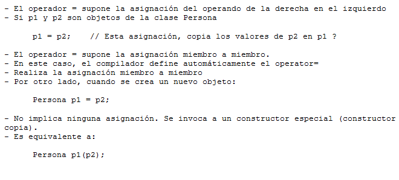

.. -*- coding: utf-8 -*-

.. _rcs_subversion:

Clase 04 - PGE 2016
===================

**Copiar objetos**

**Constructor copia**

.. figure:: images/clase04/constructor_copia.png

**Operador de asignación**

.. figure:: images/clase04/operador_asignacion.png

**Ejercicio:**
	- Definir la clase LineaDeTexto que herede de QLineEdit
	- Sobrecargar el operator+ operator= y el contructor copia para que se puede ejecutar la siguiente línea de código:
	
.. code-block:: c
	
	linea = linea1 + linea2;  
	// Los tres son objetos LineaDeTexto y la suma devuelve un LineaDeTexto que tiene los textos concatenados
	
MiniExámenes
============

- Se promediarán para la tercer nota de POO
- Previstos: Agosto 24 - Septiembre 28 - ...
- Tiempo: 30 minutos
- Temas para el 24 de agosto: 
	- template
	- Sobrecarga de operadores
	- Clase Listado

