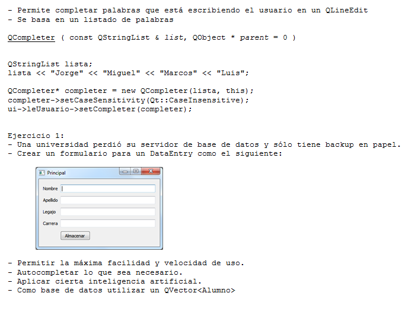

.. -*- coding: utf-8 -*-

.. _rcs_subversion:

Clase 05 - PGE 2016
===================

**Resololución del Ejercicio LineaDeTexto:**

.. code-block::

	#include <QApplication>
	#include <QLineEdit>
	#include <QString>

	class LineaDeTexto : public QLineEdit  {
	    // Q_OBJECT 
	    // Si usamos Q_OBJECT sin separar la definicion de esta clase en su .h y .cpp puede no compilar
	    // Recordar que sin el Q_OBJECT no podremos definir signals ni slots en esta clase

	public:
	    LineaDeTexto(QString texto = "") : QLineEdit(texto)  {  }

	    // El constructor copia debe invocar explicitamente al constructor de 
	    // la clase base para que el compilador no tire un warning
	    LineaDeTexto(const LineaDeTexto & linea) : QLineEdit()  {
	        this->setText(linea.text());
	    }

	    LineaDeTexto& operator=(const LineaDeTexto & linea)  {
	        this->setText(linea.text());
	        return *this;
	    }

	    LineaDeTexto operator+(const LineaDeTexto & linea)  {
	        return LineaDeTexto(this->text() + linea.text());
	    }
	};

	int main(int argc, char *argv[])  {
	    QApplication a(argc, argv);
	    LineaDeTexto linea1("Hola ");
	    LineaDeTexto linea2("che");
	    LineaDeTexto total;

	    total = linea1 + linea2;
	    total.show();

	    return a.exec();
	}

Clase QCompleter
================

**Ejercicio:** Hacer lo mismo pero la base de datos que sea un archivo SQLite.

**Ejercicio:** Definir una clase genérica Vector que herede de QVector.

- Modificar el comportamiento de los siguientes métodos:
	- at() - En vez de obtener el primer elemento con 0 que lo haga con 1, el 1 con 2,...
	- size() - Bloquearlo, que no se pueda usar.
	- float getPromedio() - Si los elementos son int o float, devolver el promedio sino devolver -1

