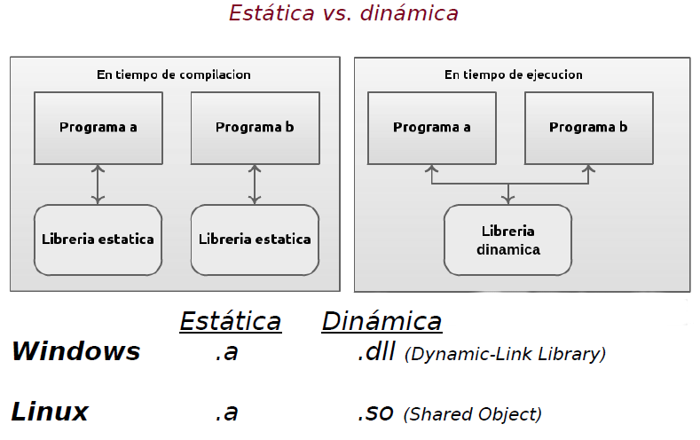

.. -*- coding: utf-8 -*-

.. _rcs_subversion:

Clase 08 - PGE 2016
===================

**Creación y uso de librerías dinámicas**

.. figure:: images/clase08/librerias01.png

.. figure:: images/clase08/librerias02.png

.. figure:: images/clase08/librerias03.png

**Ejercicio:**
	- Utilizar la clase LineaDeTexto.
	- Con todas las carecterísticas que hemos hido agregando (las sugerencias, los operadores, etc.)
	- Crear una librería dinámica con esta clase.
	- Usar esta librería en otro proyecto para probar su funcionamiento.

