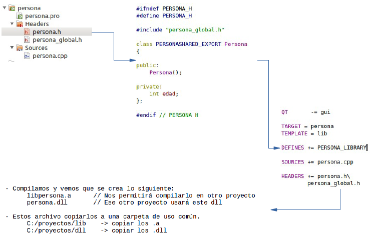

.. -*- coding: utf-8 -*-

.. _rcs_subversion:

Clase 08 - PGE 2017
===================
(Fecha: 6 de septiembre)

**Creación y uso de librerías dinámicas**

.. figure:: images/clase08/librerias.png

.. figure:: images/clase08/librerias01.png

.. figure:: images/clase08/librerias03.png

**Ejercicio:**
	- Utilizar la clase LineaDeTexto.
	- Con todas las carecterísticas que hemos hido agregando (las sugerencias, los operadores, etc.)
	- Crear una librería dinámica con esta clase.
	- Usar esta librería en otro proyecto para probar su funcionamiento.

MiniExamen de preguntas múltiples
=================================

:Tarea para Clase 9:
	Completar y estudiar exhaustivamente operador de asignación y constructor copia

	Estudiar eventFilter y LineaDeTexto mejorado

	Ver `Tutorial Qt Creator - qDebug Operador de inserción <https://www.youtube.com/watch?v=IBMU3FyisKY>`_ de `Videos tutoriales de Qt <https://www.youtube.com/playlist?list=PL54fdmMKYUJvn4dAvziRopztp47tBRNum>`_

	Ver `Tutorial Qt Creator - Timer <https://www.youtube.com/watch?v=_Ps7aHDoAr4>`_ de `Videos tutoriales de Qt <https://www.youtube.com/playlist?list=PL54fdmMKYUJvn4dAvziRopztp47tBRNum>`_

	Ver `Tutorial Qt Creator - QTimer <https://www.youtube.com/watch?v=c6JZECBL54Q>`_ de `Videos tutoriales de Qt <https://www.youtube.com/playlist?list=PL54fdmMKYUJvn4dAvziRopztp47tBRNum>`_

	Ver `Tutorial Qt Creator - Archivo de recursos <https://www.youtube.com/watch?v=u8xKE0zHLsE>`_ de `Videos tutoriales de Qt <https://www.youtube.com/playlist?list=PL54fdmMKYUJvn4dAvziRopztp47tBRNum>`_

