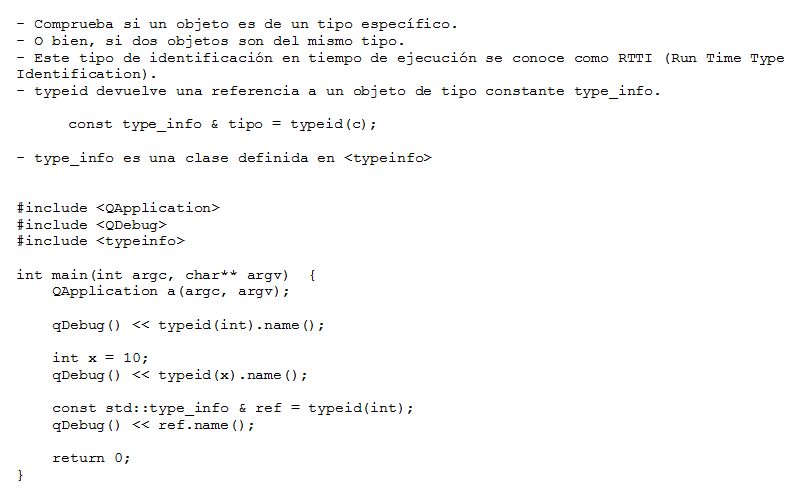
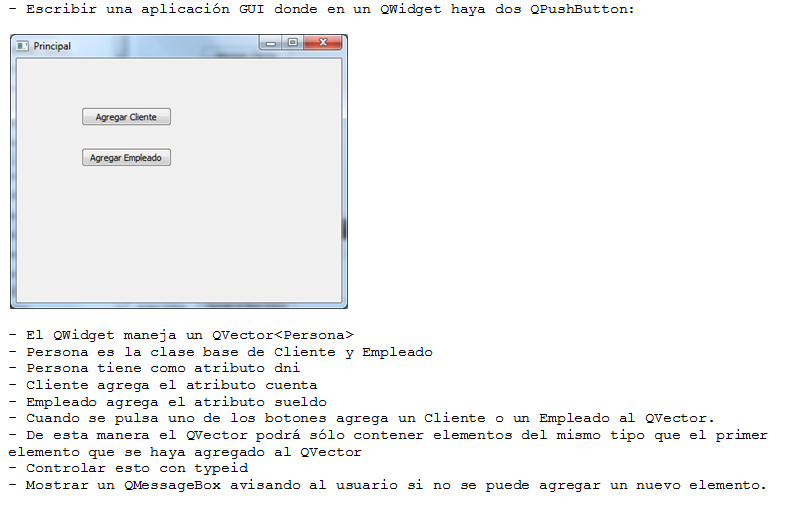

.. -*- coding: utf-8 -*-

.. _rcs_subversion:

Clase 09 - PGE 2016
===================

**QMainWindow**

.. figure:: images/clase08/qmainwindow.png

**QAction**

.. figure:: images/clase08/qaction.png

**QIcon**

.. figure:: images/clase08/qicon.png

:Buscar íconos aquí: http://findicons.com/

**Ejercicio:** Editor de  código fuente C++

.. figure:: images/clase08/ejercicio.png

**typeid**

**Clase type_info**

- Dispone de un método para preguntar si es puntero y otro método para saber si es puntero a función:
		    
.. code-block::
			
	virtual bool __is_pointer_p() const;
   
	virtual bool __is_function_p() const;

.. figure:: images/clase09/type_info.png

**Ejercicio 1**

.. figure:: images/clase09/ejercicio1.png

**Ejercicio 2**

**Temas para el parcial**
	- Template (Clases genéricas, herencia, argumento por defecto, etc.)
	- Sobrecarga de operadores
	- Constructor copia y operador de asignación
	- static
	- QCompleter, eventFilter
	- Creación y uso de librerías dinámicas
	- QWidgets propios promocionados en QtDesigner
	

