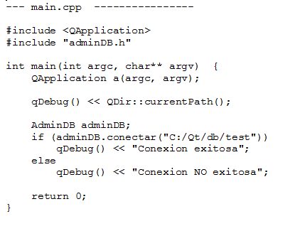
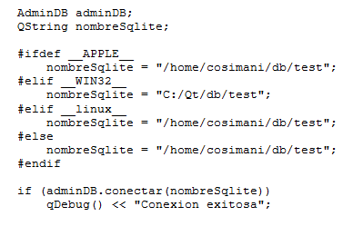

.. -*- coding: utf-8 -*-

.. _rcs_subversion:

Clase 11 - PGE 2016
===================

Base de datos con SQLite
========================

.. figure:: images/clase09/sqlite1.png

.. figure:: images/clase09/sqlite2.png

.. figure:: images/clase09/sqlite3.png

**Ejercicio 4**

.. figure:: images/clase09/ejercicio4.png

**Para independizar del SO**

**Consulta a la base de datos**

.. figure:: images/clase09/consultar1.png

.. figure:: images/clase09/consultar2.png

**typeid**

.. figure:: images/clase09/typeid.png

**Clase type_info**

- Dispone de un método para preguntar si es puntero y otro método para saber si es puntero a función:
		    
.. code-block::
			
	virtual bool __is_pointer_p() const;
   
	virtual bool __is_function_p() const;

.. figure:: images/clase09/type_info.png

**Ejercicio 1**

.. figure:: images/clase09/ejercicio1.png

**Ejercicio 2**

.. figure:: images/clase09/ejercicio2.png

**Temas para el parcial**
	- Template (Clases genéricas, herencia, argumento por defecto, etc.)
	- Sobrecarga de operadores
	- Constructor copia y operador de asignación
	- static
	- QCompleter, eventFilter
	- Creación y uso de librerías dinámicas
	- QWidgets propios promocionados en QtDesigner
	

