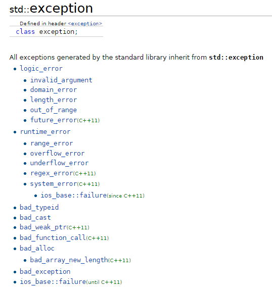

.. -*- coding: utf-8 -*-

.. _rcs_subversion:

Clase 15 - PGE 2016
===================

Tratamiento de excepciones
^^^^^^^^^^^^^^^^^^^^^^^^^^

.. figure:: images/clase15/excepciones1.png

* `Explicación por un youtuber <http://www.youtube.com/watch?v=wcuknro_V-w>`_

**Excepciones de la biblioteca estándar de C++**

Mini Examen 2
^^^^^^^^^^^^^

- `Código fuente de la escena sin textura <https://github.com/cosimani/Curso-PGE-2016/blob/master/resources/clase15/Ejercicio1.rar?raw=true>`_

- Escena para replicar (https://www.youtube.com/watch?v=5M-Edl9veuQ)

