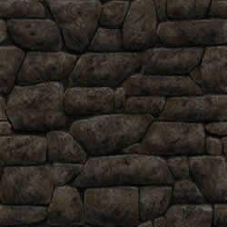

.. -*- coding: utf-8 -*-

.. _rcs_subversion:

Clase 17 - PGE 2016
===================

Función callback
^^^^^^^^^^^^^^^^

- Función que se llama a través de un puntero a función.
- Se puede utilizar como parámetro de otra función.
- Cuando la función que recibe este puntero a función hace uso de este, se dice que hace una retrollamada (callback).
- Si en la clase Listado deseamos que se ordenen los datos pero no queremos incluir (en Listado) la lógica de un método de ordenamiento, podemos pedir al programador que nos pase como parámetro un puntero a su propia función de ordenamiento.
- Se podría utilizar para una simple notificación o comunicación de dos vías (similar a las signals y slots).
- Cuando un diseñador de bibliotecas quiere notificar al programador sobre algún suceso, puede solicitar un puntero a función.

**Declaraciones de punteros a funciones:**

.. code-block:: c++

	void (*fptr)();  
	// puntero a una función sin parámetros que devuelve void.

	void (*fptr)(int);	
	// puntero a función que recibe int y devuelve void.

	int (*fptr)(int, char);		
	// acepta int y char y devuelve un int.

	int * (*fptr)();	
	// puntero a función, sin argumentos y devuelve puntero a int

**Declaraciones de punteros a funciones (o métodos) de clases:**

.. code-block:: c++

	void (C::*puntero) (int);  // puntero a método de la clase C

	int (C::*puntero) ();

- Antes de usar un puntero a función es necesario definirlo (asignarle un valor).
- El valor es la dirección de memoria donde inicia una función concreta.

.. code-block:: c++

	char funcion(int);  // Declara una función concreta

	char (*puntero_funcion) (int);  // Declara un puntero a función

	puntero_funcion = &funcion;  // Asigna al puntero la dirección de memoria de funcion(int)

**Luego de declarado y definido, podemos usarlo de dos formas:**

- Acceder (invocar), a la función que representa
- Usarlo como parámetro de otra función.

**Invocación**

.. code-block:: c++

	char funcion(int);  // Declara función concreta. Suponemos que está definida en otro lugar.

	char (*puntero_funcion)(int);  // Declaramos puntero a función

	puntero_funcion = &funcion;  // Asigna la dirección de memoria

	int i = 10;
	char c;

	c = (*puntero_funcion)(i);

**Ejemplo**

.. code-block:: c++

	#include <iostream>

	void funcion() {  std::cout << "Una funcion cualquiera" << std::endl; }
	void (*puntero_funcion)() = &funcion; 

	int main ()  {      
	    funcion();     
	    (*puntero_funcion)(); 
	    puntero_funcion();   

	    return 0;
	}

	// Salida:
	// Una funcion cualquiera
	// Una funcion cualquiera
	// Una funcion cualquiera

**Paso de funciones como argumento**

.. code-block:: c++

	void funcion(void (*puntero_funcion)() ) {  
	    // Código de este método

	    (*puntero_funcion)();  // Llama a la función apuntada
	}

**Ejercicio 1:** Definir la siguiente clase:

.. code-block:: c++

	class Ordenador  {
	public:
	    void burbuja(int * v, int n)  {  /* código */  }
	    void insercion(int * v, int n)  {  /* código */  }

	    void seleccion(int * v, int n)  {  /* código */  }
	};

- Esta clase tendrá distintos métodos de ordenamiento.
- Cada método ordena un array de n cantidad de enteros
- Definir la clase ListaDeEnteros
	- Herede de QVector
	- Que no sea un template
	- Que sólo mantenga elementos del tipo int
	- Definir un método:
	
.. code-block:: c++	
		
	void ordenar(Ordenador::*puntero_funcion)(int * v, int n))
	// Este método ordenará los elementos

**Podemos ahora llevar las imágenes de la cámara como textura a OpenGL**

.. code-block:: c++

	class Visual : public Ogl  {
		Q_OBJECT
	public:
		Visual();
		void iniciarCamara();

	protected:
		void initializeGL();
		void resizeGL(int ancho, int alto);
		void paintGL();

	private:
		Capturador * capturador;
		QCamera * camera;

		void cargarTexturas();
		void cargarTexturaCamara();

		unsigned char *texturaCielo;
		unsigned char *texturaMuro;
		GLuint idTextura[2];

		unsigned char *texturaCamara;
		GLuint idTexturaCamara[1];
	};

	void Visual::iniciarCamara()  {
		capturador = new Capturador;

		QList<QCameraInfo> cameras = QCameraInfo::availableCameras();

		for (int i=0 ; i<cameras.size() ; i++)  {
			qDebug() << cameras.at(i).description();

			if (cameras.at(i).description().contains("Truevision", Qt::CaseInsensitive))  {
				camera = new QCamera(cameras.at(i));
				camera->setViewfinder(capturador);
				camera->start(); // to start the viewfinder
			}
		}

		glGenTextures(1, idTexturaCamara);
	}

	void Visual::cargarTexturaCamara()  {

		QVideoFrame frameActual = capturador->getFrameActual();
		texturaCamara = frameActual.bits();

		glBindTexture(GL_TEXTURE_2D, idTexturaCamara[0]);  // Activamos idTextura.
		glTexParameteri(GL_TEXTURE_2D, GL_TEXTURE_MAG_FILTER, GL_LINEAR); 
		glTexParameteri(GL_TEXTURE_2D, GL_TEXTURE_MIN_FILTER, GL_LINEAR); 

		glTexImage2D(GL_TEXTURE_2D, 
		             0, 
		             3, 
		             frameActual.width(), 
		             frameActual.height(), 
		             0, 
		             GL_BGRA, 
		             GL_UNSIGNED_BYTE, 
		             texturaCamara);
	}

**Ejercicio 40:**

- Crear una escena con OpenGL con glOrtho para mostrar como textura las imágenes de la cámara en un QUADS.
- Luego probar con gluPerspective

**Resolución**

:Código fuente: https://github.com/cosimani/Curso-PGE-2015/tree/master/sources/clase11/ejercicio1
	
**Ejercicio 41:**

- Crear una aplicación para mostrar una escena 3D con OpenGL que tenga las siguientes características:
	- Utilizar la clase Ogl
	- La escena tendrá un cielo como se muestra a continuación:

.. figure:: images/clase11/cielo.jpg
	:target: http://img02.bibliocad.com/biblioteca/image/00010000/4000/cieloclaro_14054.jpg

- Ahora agregar una textura para el piso. Esta textura deberá repetirse para que quede similar a la siguiente figura:

.. figure:: images/clase11/tierra.jpg
	:target: http://www.textureimages.net/uploads/6/1/2/6/6126732/8772372_orig.jpg

- Dibujar ahora un muro al final del camino. Que la textura se repita también. 

	
- Utilizando las teclas UP y DOWN generar el efecto de avanzar y retroceder. Que no permita irse más allá del muro y que no permita retroceder más del punto inicial de partida.

.. figure:: images/clase11/escena.png

**Ejercicio 42:**

- Usar el ejercicio anterior
- Colgar de la tapia del fondo un monitor LCD mostrando las imágenes de la cámara

**Ejercicio 43:**

- En el medio del escenario tapia-piso-cielo dibujar un cubo girando
- Pegar la textura de la cámara en cada lado del cubo

**Ejercicio 44:**

- Continuar con el ejercicio de la pantalla con las imágenes de la cámara
- Incorporar otro LCD mostrando como textura una imagen de Street View

**Ejercicio 45:**

- En el ejercicio donde se utilizó el QComboBox para elegir la cámara, incorporar Archivador.
- Que se almacene en un archivo la fecha y hora de cada vez que se inicia la cámara.

Mini Examen 2
^^^^^^^^^^^^^

- `Código fuente de la escena sin textura <https://github.com/cosimani/Curso-PGE-2016/blob/master/resources/clase15/Ejercicio1.rar?raw=true>`_

- Escena para replicar (https://www.youtube.com/watch?v=5M-Edl9veuQ)

