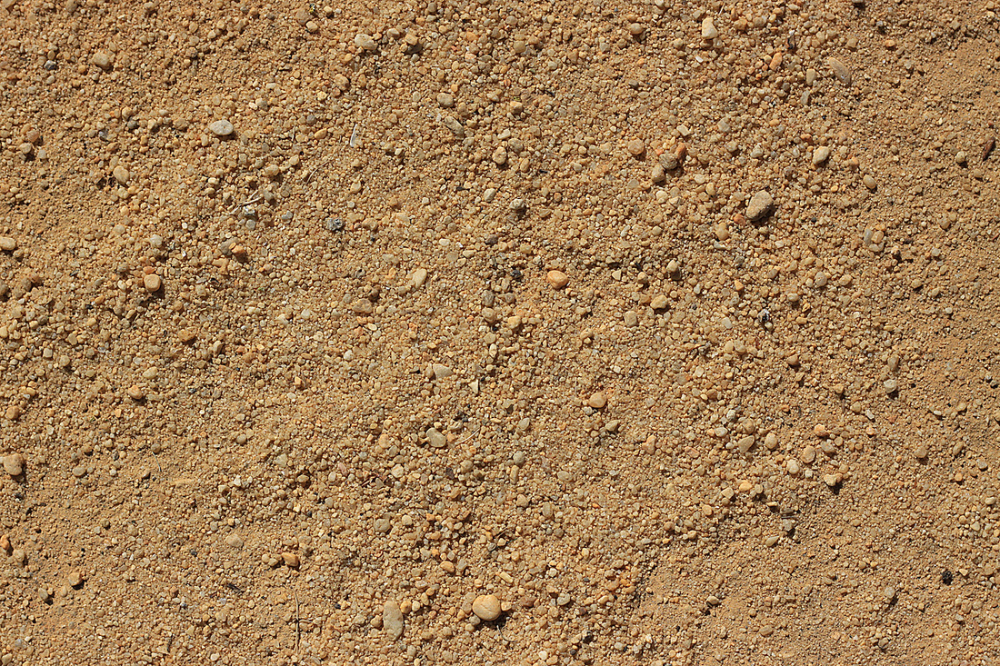
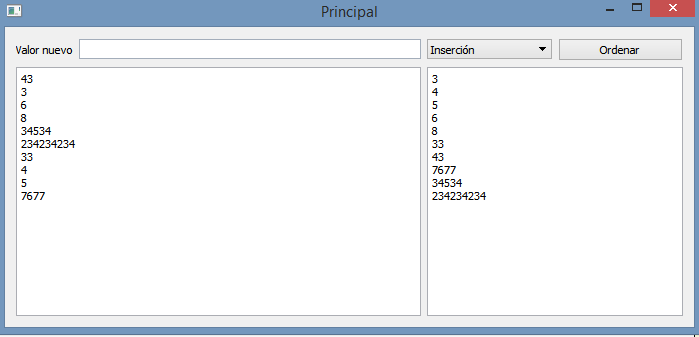

.. -*- coding: utf-8 -*-

.. _rcs_subversion:

Clase 19 - PGE 2017
===================
(Fecha: 31 de octubre)

MiniExamen de preguntas múltiples
=================================

:Tarea para Clase 21 (5 de noviembre):
	Ver `Tutorial Qt Creator - Librería DLL <https://www.youtube.com/watch?v=WSk8ojnCrrI>`_ de `Videos tutoriales de Qt <https://www.youtube.com/playlist?list=PL54fdmMKYUJvn4dAvziRopztp47tBRNum>`_

	Ver `Tutorial Qt Creator - Librería estática <https://www.youtube.com/watch?v=nqS5WNZZnzU>`_ de `Videos tutoriales de Qt <https://www.youtube.com/playlist?list=PL54fdmMKYUJvn4dAvziRopztp47tBRNum>`_

	Ver `Tutorial Qt Creator - QWidget <https://www.youtube.com/watch?v=NpwRtpndqA4>`_ de `Videos tutoriales de Qt <https://www.youtube.com/playlist?list=PL54fdmMKYUJvn4dAvziRopztp47tBRNum>`_

	Ver `Tutorial Qt Creator - Sintaxis alternativa de signals & slots <https://www.youtube.com/watch?v=ARPUSKsU3-U>`_ de `Videos tutoriales de Qt <https://www.youtube.com/playlist?list=PL54fdmMKYUJvn4dAvziRopztp47tBRNum>`_

	Ver `Tutorial Qt Creator - Caso especial de signal & slot <https://www.youtube.com/watch?v=cBcbmRGAktU>`_ de `Videos tutoriales de Qt <https://www.youtube.com/playlist?list=PL54fdmMKYUJvn4dAvziRopztp47tBRNum>`_

	Ver `Tutorial Qt Creator - Slot lambda <https://www.youtube.com/watch?v=XL6OTXEh6P8>`_ de `Videos tutoriales de Qt <https://www.youtube.com/playlist?list=PL54fdmMKYUJvn4dAvziRopztp47tBRNum>`_
	

**Podemos ahora llevar las imágenes de la cámara como textura a OpenGL**

.. code-block:: c++

	class Visual : public Ogl  {
		Q_OBJECT
	public:
		Visual();
		void iniciarCamara();

	protected:
		void initializeGL();
		void resizeGL(int ancho, int alto);
		void paintGL();

	private:
		Capturador * capturador;
		QCamera * camera;

		void cargarTexturas();
		void cargarTexturaCamara();

		unsigned char *texturaCielo;
		unsigned char *texturaMuro;
		GLuint idTextura[2];

		unsigned char *texturaCamara;
		GLuint idTexturaCamara[1];
	};

	void Visual::iniciarCamara()  {
		capturador = new Capturador;

		QList<QCameraInfo> cameras = QCameraInfo::availableCameras();

		for (int i=0 ; i<cameras.size() ; i++)  {
			qDebug() << cameras.at(i).description();

			if (cameras.at(i).description().contains("Truevision", Qt::CaseInsensitive))  {
				camera = new QCamera(cameras.at(i));
				camera->setViewfinder(capturador);
				camera->start(); // to start the viewfinder
			}
		}

		glGenTextures(1, idTexturaCamara);
	}

	void Visual::cargarTexturaCamara()  {

		QVideoFrame frameActual = capturador->getFrameActual();
		texturaCamara = frameActual.bits();

		glBindTexture(GL_TEXTURE_2D, idTexturaCamara[0]);  // Activamos idTextura.
		glTexParameteri(GL_TEXTURE_2D, GL_TEXTURE_MAG_FILTER, GL_LINEAR); 
		glTexParameteri(GL_TEXTURE_2D, GL_TEXTURE_MIN_FILTER, GL_LINEAR); 

		glTexImage2D(GL_TEXTURE_2D, 
		             0, 
		             3, 
		             frameActual.width(), 
		             frameActual.height(), 
		             0, 
		             GL_BGRA, 
		             GL_UNSIGNED_BYTE, 
		             texturaCamara);
	}

**Ejercicio 40:**

- Crear una escena con OpenGL con glOrtho para mostrar como textura las imágenes de la cámara en un QUADS.
- Luego probar con gluPerspective

**Resolución**

:Código fuente: https://github.com/cosimani/Curso-PGE-2015/tree/master/sources/clase11/ejercicio1
	
**Ejercicio 41:**

- Crear una aplicación para mostrar una escena 3D con OpenGL que tenga las siguientes características:
	- Utilizar la clase Ogl
	- La escena tendrá un cielo como se muestra a continuación:

.. figure:: images/clase11/cielo.jpg
	:target: http://img02.bibliocad.com/biblioteca/image/00010000/4000/cieloclaro_14054.jpg

- Ahora agregar una textura para el piso. Esta textura deberá repetirse para que quede similar a la siguiente figura:

- Dibujar ahora un muro al final del camino. Que la textura se repita también. 

.. figure:: images/clase11/pared.jpg
	:target: http://img02.bibliocad.com/biblioteca/image/00030000/0000/muropiedratextura_30115.jpg
	
- Utilizando las teclas UP y DOWN generar el efecto de avanzar y retroceder. Que no permita irse más allá del muro y que no permita retroceder más del punto inicial de partida.

.. figure:: images/clase11/escena.png

**Ejercicio 42:**

- Usar el ejercicio anterior
- Colgar de la tapia del fondo un monitor LCD mostrando las imágenes de la cámara

**Ejercicio 43:**

- En el medio del escenario tapia-piso-cielo dibujar un cubo girando
- Pegar la textura de la cámara en cada lado del cubo

**Ejercicio 44:**

- Continuar con el ejercicio de la pantalla con las imágenes de la cámara
- Incorporar otro LCD mostrando como textura una imagen de Street View

**Ejercicio 45:**

- En el ejercicio donde se utilizó el QComboBox para elegir la cámara, incorporar Archivador.
- Que se almacene en un archivo la fecha y hora de cada vez que se inicia la cámara.

Mini Examen 2
^^^^^^^^^^^^^

- `Código fuente de la escena sin textura <https://github.com/cosimani/Curso-PGE-2016/blob/master/resources/clase15/Ejercicio1.rar?raw=true>`_

- Escena para replicar (https://www.youtube.com/watch?v=5M-Edl9veuQ)

**Ejercicio:** Este trabajo es entregable y es parte de una nota más de MiniExámenes. 

- **Entrega:** 1ero de noviembre hasta las 23.59 horas. 
- Agregar la funcionalidad de sugerencias a la clase LineaDeTexto y que dichas sugerencias las busque desde Google.
- Ejemplo en: http://doc.qt.io/qt-5/qtnetwork-googlesuggest-example.html
- `Descargar LineaDeTexto con sugerencias de Google aquí <https://github.com/cosimani/Curso-PGE-2015/blob/master/sources/clase18/lineadetexto.rar?raw=true>`_
- Implementar LineaDeTexto en un Formulario de alta de directivos de empresas (pide Nombre completo, Empresa y Cargo)
- Suponga que un Call Center llama a las empresas para dar de alta a los directivos. 
- Con apoyo de las sugerencias de Google se ingresan los datos sin errores en el nombre ni en la empresa.
- Guardar en una base Sqlite.
- Agregar en LineaDeTexto un método que recibe un puntero a una función global que aplique un filtro a las sugerencias.
- El filtro será una QStringList que contiene todas las cadenas que deberán descartarse de las sugerencias.
- El filtro se actualizará cada vez que se de de alta un nuevo directivo, la idea es que los nombre ya agregados no se sugieran más.

**Resolución Ejercicio 1: Ordenador** 

.. code-block:: c++

	#ifndef ORDENADOR
	#define ORDENADOR

	class Ordenador  {
	public:
	    void burbuja(int * v, int n)  {
	        int i, j, aux;
	        for(i=0 ; i<=n ; i++)  {
	            for(j=0 ; j<n-1 ; j++)  {
	                if(v[j] > v[j+1])  {
	                    aux = v[j];
	                    v[j] = v[j+1];
	                    v[j+1] = aux;
	                }
	            }
	        }
	    }

	    void insercion(int * v, int n)  {
	        int i, j, aux;
	        for (i=1 ; i<n; i++)  {
	            aux = v[i];
	            j = i - 1;
	            while ( (v[j] > aux) && (j >= 0) )  {
	                v[j+1] = v[j];
	                j--;
	            }
	            v[j+1] = aux;
	        }
	    }
	};

	#endif // ORDENADOR
	
.. code-block:: c++

	#ifndef LISTADOENTEROS_H
	#define LISTADOENTEROS_H

	#include <QVector>
	#include "ordenador.h"

	class ListadoEnteros : public QVector<int>  {
	public:

	    void ordenar(void (Ordenador::*pFuncionOrdenamiento)(int *, int))  {
	        (ordenador.*pFuncionOrdenamiento)(this->data(), this->size());
	    }

	private:
	    Ordenador ordenador;
	};

	#endif // LISTADOENTEROS_H
	
.. code-block:: c++

	#ifndef PRINCIPAL_H
	#define PRINCIPAL_H

	#include <QWidget>
	#include "listadoEnteros.h"

	namespace Ui {
	    class Principal;
	}

	class Principal : public QWidget  {
	    Q_OBJECT

	public:
	    explicit Principal(QWidget *parent = 0);
	    ~Principal();

	private:
	    Ui::Principal *ui;
	    ListadoEnteros listado;

	private slots:
	    void slot_ordenar();
	    void slot_valorNuevo();
	};

	#endif // PRINCIPAL_H

.. code-block:: c++

	#include "principal.h"
	#include "ui_principal.h"

	Principal::Principal(QWidget *parent) : QWidget(parent), ui(new Ui::Principal)  {
	    ui->setupUi(this);

	    connect(ui->pbOrdenar, SIGNAL(clicked()), this, SLOT(slot_ordenar()));
	    connect(ui->leValorNuevo, SIGNAL(returnPressed()), this, SLOT(slot_valorNuevo()));
	}

	Principal::~Principal()  {  delete ui;  }

	void Principal::slot_ordenar()  {

	    if (ui->cbMetodo->currentText() == "Burbuja")  {
	        void (Ordenador::*burbuja)(int *, int) = &Ordenador::burbuja;
	        listado.ordenar(burbuja);
	    }
	    else  {
	        void (Ordenador::*insersion)(int *, int) = &Ordenador::insercion;
	        listado.ordenar(insersion);
	    }

	    for (int i=0 ; i<listado.size() ; i++)  {
	        ui->teOrdenados->append(QString::number(listado.at(i)));
	    }
	}

	void Principal::slot_valorNuevo()  {
	    listado.push_back(ui->leValorNuevo->text().toInt());

	    ui->teValores->append(ui->leValorNuevo->text());

	    ui->leValorNuevo->clear();
	}