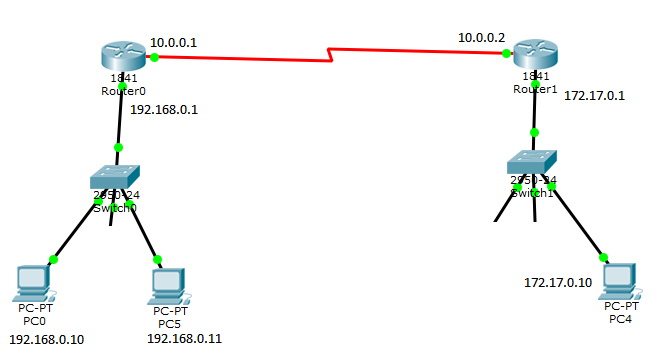

.. -*- coding: utf-8 -*-

.. _rcs_subversion:

Clase 21 - PGE 2016
===================

Ejercicio con punteros a funciones y ruteo
^^^^^^^^^^^^^^^^^^^^^^^^^^^^^^^^^^^^^^^^^^

- Pensar en la siguiente topología

- `Descargar el siguiente proyecto Qt <https://github.com/cosimani/Curso-PGE-2016/blob/master/resources/clase21/redes.rar?raw=true>`_
- En la clase Router definir un método que reciba como parámetro un puntero a función, por ejemplo:

.. code-block:: c++	

	void setTabla( QList<QStringList> (*puntero) () );
	
- El puntero apunta a una función global en el archivo de cabecera rutas.h donde existen varias funciones que generan distintas tablas de ruteo.
- Notar que cada router tiene su propia tabla de ruteo

Ejercicios para OpenGL y Procesamiento de Imágenes
^^^^^^^^^^^^^^^^^^^^^^^^^^^^^^^^^^^^^^^^^^^^^^^^^^

.. ..

 <!--- Esta es la forma para ocultar texto. Ver instrucciones más abajo para ampliar.

 Usabilidad
 ^^^^^^^^^^

 - Se refiere a la capacidad de ser comprendido, aprendido, usado y ser atractivo.

 - El concepto de usabilidad involucra:
	- Aprendizaje
	- Eficiencia (que se logre la tarea o meta)
	- Recordación
	- Manejo de errores
	- Satisfacción

 **Mensajes de error**

 - Los errores ocurren por falta de conocimiento, comprensión incorrecta o equivocaciones involuntarias.
 - Es probable que el usuario esté confundido.
 - Mensajes de error demasiado genéricas no ayudan.
 - Los sistemas se recuerdan más cuando las cosas van mal.
 - Mejorar los mensajes de error es una buena forma de mejorar la interfaz.
 - Los logs de errores permiten a los desarrolladores revisar procedimientos y mejorar la documentación.
 - Se recomienda crear mensajes de error con tono positivo, especificidad y formato apropiado.

 **Tono positivo**

 - No condenar al usuario.
 - Las palabras MAL, ILEGAL, ERROR deberían eliminarse.
 - Los mensajes hostiles alteran a los usuarios no técnicos.
 - Error 800405: Fallo del método string de objeto Sistema.

 **Especificidad**

 - ERROR DE SINTAXIS  ---->  Paréntesis izquierdo sin correspondencia
 - ENTRADA ILEGAL     ---->  Escriba la primer letra Enviar, Leer o Eliminar
 - DATOS INVÁLIDOS    ---->  Los días deben estar en el intervalo 1 - 31
 - NOMBRE INVÁLIDO    ---->  El archivo C:\Datos\datos.txt no existe

 **Formato apropiado**  

 - Los mensajes que comienzan con un código numérico y misterioso no sirven a los usuarios comunes.
 - Llamar la atención pero sin molestar al usuario.
 - Mostrar un cuadro de texto cerca del problema pero sin ocultarlo.
 --->

 <!--- Need blank line before this line (and the .. line above).
 HTML comment written with 3 dashes so that Pandoc suppresses it.
 Blank lines may appear anywhere in the comment.

 All non-blank lines must be indented at least one space.
 HTML comment close must be followed by a blank line and a line
 that is not indented at all (if necessary that can be a line
 with just two periods followed by another blank line).
 --->
 

Temas para segundo parcial
^^^^^^^^^^^^^^^^^^^^^^^^^^

- Imágenes de cámaras con QCameraViewfinder y QAbstractVideoSurface (traer cámara USB si van a usar PC de laboratorio, o pedirme que tengo).
- Análisis pixel a pixel, escala de grises, negativo, eliminar componente
- Tratamiento de excepciones
- Hilos con QThread
- Callback, punteros a funciones, punteros a métodos de clases
- LineaDeTexto con sugerencia de Google
- OpenGL, texturas, imagen de la cámara como textura
