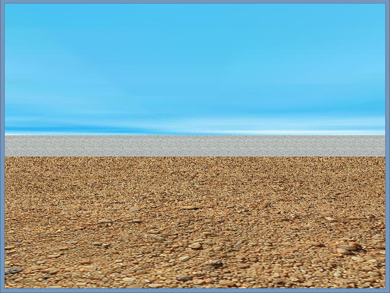

.. -*- coding: utf-8 -*-

.. _rcs_subversion:

Clase 24 - PGE 2015 (No actualizado)
===================

Recursos para Recuperatorios
^^^^^^^^^^^^^^^^^^^^^^^^^^^^

- `Habitación <https://github.com/cosimani/Curso-PGE-2015/blob/master/sources/clase23/Habitacion.rar?raw=true>`_

- Video sobre lo que se desea replicar (https://www.youtube.com/watch?v=Jr_luYdSfRE)

Mini Examen 2
^^^^^^^^^^^^^

- `Código fuente de la escena sin textura <https://github.com/cosimani/Curso-PGE-2016/blob/master/resources/clase15/Ejercicio1.rar?raw=true>`_

- Escena para replicar (https://www.youtube.com/watch?v=5M-Edl9veuQ)

**Ejercicio:** Este trabajo es entregable y es parte de una nota más de MiniExámenes. 

- **Entrega:** 1ero de noviembre hasta las 23.59 horas. 
- Agregar la funcionalidad de sugerencias a la clase LineaDeTexto y que dichas sugerencias las busque desde Google.
- Ejemplo en: http://doc.qt.io/qt-5/qtnetwork-googlesuggest-example.html
- `Descargar LineaDeTexto con sugerencias de Google aquí <https://github.com/cosimani/Curso-PGE-2015/blob/master/sources/clase18/lineadetexto.rar?raw=true>`_
- Implementar LineaDeTexto en un Formulario de alta de directivos de empresas (pide Nombre completo, Empresa y Cargo)
- Suponga que un Call Center llama a las empresas para dar de alta a los directivos. 
- Con apoyo de las sugerencias de Google se ingresan los datos sin errores en el nombre ni en la empresa.
- Guardar en una base Sqlite.
- Agregar en LineaDeTexto un método que recibe un puntero a una función global que aplique un filtro a las sugerencias.
- El filtro será una QStringList que contiene todas las cadenas que deberán descartarse de las sugerencias.
- El filtro se actualizará cada vez que se de de alta un nuevo directivo, la idea es que los nombre ya agregados no se sugieran más.

**Ejercicio 41:**

- Crear una aplicación para mostrar una escena 3D con OpenGL que tenga las siguientes características:
	- Utilizar la clase Ogl
	- La escena tendrá un cielo como se muestra a continuación:

.. figure:: images/clase11/cielo.jpg
	:target: http://img02.bibliocad.com/biblioteca/image/00010000/4000/cieloclaro_14054.jpg

- Ahora agregar una textura para el piso. Esta textura deberá repetirse para que quede similar a la siguiente figura:

.. figure:: images/clase11/tierra.jpg
	:target: http://www.textureimages.net/uploads/6/1/2/6/6126732/8772372_orig.jpg

- Dibujar ahora un muro al final del camino. Que la textura se repita también. 

.. figure:: images/clase11/pared.jpg
	:target: http://img02.bibliocad.com/biblioteca/image/00030000/0000/muropiedratextura_30115.jpg
	
- Utilizando las teclas UP y DOWN generar el efecto de avanzar y retroceder. Que no permita irse más allá del muro y que no permita retroceder más del punto inicial de partida.

**Ejercicio 42:**

- Usar el ejercicio anterior
- Colgar de la tapia del fondo un monitor LCD mostrando las imágenes de la cámara

**Ejercicio 43:**

- En el medio del escenario tapia-piso-cielo dibujar un cubo girando
- Pegar la textura de la cámara en cada lado del cubo

**Ejercicio 44:**

- Continuar con el ejercicio de la pantalla con las imágenes de la cámara
- Incorporar otro LCD mostrando como textura una imagen de Street View

**Ejercicio 45:**

- En el ejercicio donde se utilizó el QComboBox para elegir la cámara, incorporar Archivador.
- Que se almacene en un archivo la fecha y hora de cada vez que se inicia la cámara.

Propuesta para Mini Examen 3
^^^^^^^^^^^^^^^^^^^^^^^^^^^^

.. code-block:: c++	

	#ifndef ADMINDB_H
	#define ADMINDB_H

	#include <QObject>
	#include <QSqlDatabase>

	class AdminDB : public QObject
	{
	    Q_OBJECT

	private:
	    static AdminDB *instancia;
	    explicit AdminDB(QObject *parent = 0);

	public:
	    static AdminDB *getInstancia();
	    ~AdminDB();

	    bool conectar();
	    void desconectar();
	    QStringList getNombres();
	
	private:
	    QSqlDatabase db;
	};

	#endif // ADMINDB_H

.. code-block:: c++	

	#include "admindb.h"
	#include <QDebug>
	#include <QSqlQuery>
	#include <QSqlRecord>
	#include <QSqlError>

	AdminDB *AdminDB::instancia = NULL;

	AdminDB::AdminDB(QObject *parent) : QObject(parent)  {
	    db = QSqlDatabase::addDatabase("QSQLITE");
	}

	AdminDB *AdminDB::getInstancia()  {
	    if( !instancia )  {
	        instancia = new AdminDB();
	    }
	    return instancia;
	}

	AdminDB::~AdminDB()  {
	    if (db.isOpen())
	        db.close();
	}

	bool AdminDB::conectar()  {
	    db.setDatabaseName("../db/db.sqlite");

	    return db.open();
	}

	void AdminDB::desconectar()  {
	    db.close();
	}

	QStringList AdminDB::getNombres()  {
	    QStringList nombres;

	    if ( this->conectar() )  {
	        QSqlQuery query( db );

	        query.exec("SELECT nombre FROM nombres");

	        while ( query.next() )  {
	            QSqlRecord registro = query.record();
	            nombres << registro.value(0).toString();
	        }

	        //  qDebug() << query.lastError() << query.lastQuery();
	        this->desconectar();
	    }
	    else
	        qDebug() << "No se encuentra conectado a la base";

	    return nombres;
	}

.. code-block:: c++	

	#ifndef FILTROS_H
	#define FILTROS_H

	#include <QStringList>
	#include "admindb.h"

	QStringList filtroNombres()  {

	    QStringList palabrasExcluidas = AdminDB::getInstancia()->getNombres();
	    return palabrasExcluidas;
	}

	QStringList filtroEmpresas()  {

	    QStringList palabrasExcluidas = AdminDB::getInstancia()->getEmresas();
	    return palabrasExcluidas;
	}

	#endif // FILTROS_H

.. code-block:: c++	

    // En LineaDeTexto

	private:
	    QStringList (*puntero)();
		
	public:
	    void conectarPuntero( QStringList (*puntero)() )  {
	        this->puntero = puntero;
	    }
		
.. code-block:: c++	

	// En el constructor de Ventana
	ui->leNombre->conectarPuntero( &filtroNombres );
	ui->leEmpresa->conectarPuntero( &filtroEmpresas );

